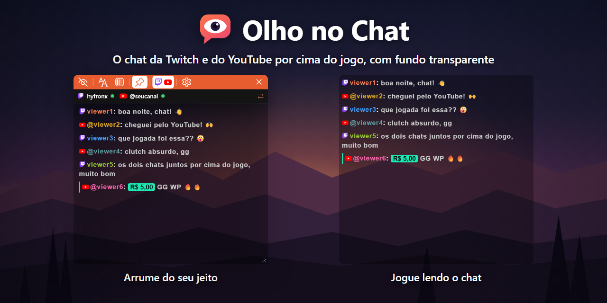

# Olho no Chat

Mostra o chat da sua live por cima do jogo, com fundo transparente. Feito para quem faz live com um monitor só e precisa ler o chat sem sair do jogo.

## Como instalar

1. Baixe o `OlhoNoChat-win-Setup.exe` na página de [versões](https://github.com/hyfronx/olho-no-chat/releases/latest).
2. Abra o instalador. Se aparecer o aviso "O Windows protegeu o computador", clique em **Mais informações** e depois em **Executar assim mesmo**. Isso só acontece na primeira vez.
3. Digite o nome do seu canal na faixa em cima do chat e clique em **Aplicar**.

## Como usar

- Arraste a barra laranja de cima para mover a janela e as bordas ou o canto de baixo à direita (com os pontinhos) para mudar o tamanho.
- O botão **Ocultar bordas** deixa só o chat por cima do jogo.
- A barra laranja em cima tem botões só com ícone (o nome aparece ao parar o mouse em cima): **Ocultar bordas**, **Tamanho do texto** e **Fundo** (cada um abre um controle deslizante; a rodinha do mouse em cima do botão também muda o valor), **Sempre no topo**, **Escrever no chat** e **Configurações**. Com as bordas visíveis, o chat já rola com a rodinha do mouse.
- **Sempre no topo** (alfinete) ligado deixa o chat sempre na frente do jogo; desligado, a janela do chat fica como uma janela normal. **Ctrl + Alt + F8** liga e desliga.
- Para mostrar as bordas de novo, clique com o botão direito no ícone do Olho no Chat na barra de tarefas ou perto do relógio.
- **Ctrl + Alt + F7** liga o modo rolagem: dá pra rolar o chat com a rodinha do mouse para ler mensagens antigas. Aperte de novo para voltar ao jogo.
- Para escrever no chat: conecte sua conta em **Configurações > Twitch** (abre a Twitch no seu navegador; se você já estiver logado, é só clicar em **Autorizar**). Com o tipo de chat **Padrão** ou **Chat oficial da Twitch** (no **Endereço personalizado** não dá para escrever), o botão **Escrever no chat** (balão de conversa) da barra laranja abre a caixa **Escrever no chat…** embaixo do chat. No jogo, **Ctrl + Alt + F11** abre a caixa; **Enter** envia e a caixa continua aberta para a próxima mensagem. Para ela fechar e o jogo voltar para a frente depois de enviar, ligue **Fechar a caixa depois de enviar** em **Configurações > Twitch**. O **×** da caixa, **Esc**, o balão ou o atalho de novo fecham a caixa. No **Chat oficial da Twitch** você também pode usar a caixa da própria Twitch (com lista de emotes e respostas): escolha em **Configurações > Twitch > Caixa de digitar**; ela pede para entrar na Twitch dentro da janela do chat.
- Nas configurações você escolhe tema, som de nova mensagem, filtros de usuários e atalhos de teclado.

O jogo precisa estar em modo **janela** ou **tela cheia sem bordas** para o chat aparecer por cima.

## Recursos

- Reconexão automática: se a conexão do chat cair ou a página travar, o app conecta de novo sozinho.
- Escrever no chat sem sair do jogo (precisa conectar a conta da Twitch), com a lista dos seus emotes (os animados se mexem). A lista fica guardada no computador e abre na hora.
- Resgates de pontos do canal no chat Padrão (opcional, precisa conectar a conta da Twitch).
- Filtros e destaques por usuário, moderadores e VIPs.
- No **Chat oficial da Twitch**, opções para esconder partes da página da Twitch: o título "Chat da live", o placar do topo e os destaques (enquetes, palpites, hype train, mensagem fixada e drops). Ficam em **Configurações > Chat > Página da Twitch**.

## Créditos

Os sons de nova mensagem são do [Notification Sounds](https://notificationsounds.com), com a licença [CC BY 4.0](https://creativecommons.org/licenses/by/4.0/deed.pt-br) (convertidos de MP3 para WAV). O link de cada som está em [CREDITOS.txt](CREDITOS.txt), que também vai junto com o app instalado.

## Licença

Copyright © 2026 Hyfronx. Distribuído sob a [GNU GPL v3](LICENSE): qualquer pessoa pode usar, estudar, mudar e distribuir o Olho no Chat, e quem distribuir uma versão modificada precisa publicar o código dela com a mesma licença.
